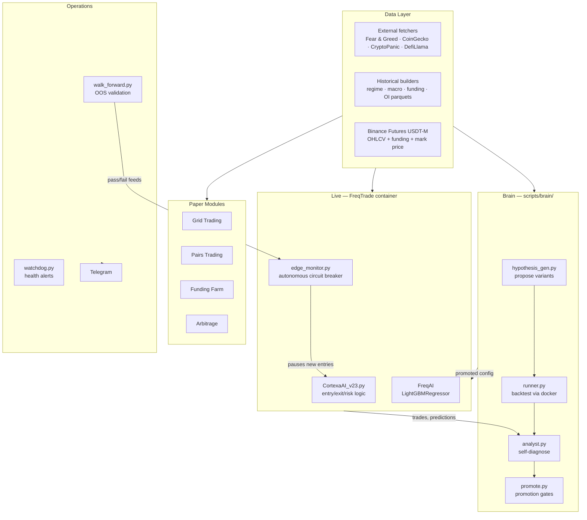

# Architecture

## The shape of the system

## The three layers

**Data.** External fetchers (Fear & Greed, CoinGecko, CryptoPanic, DefiLlama, Google Trends) run
every 15 minutes. Historical builders turn live snapshots into per-candle parquet series so
backtests can see the same regime/macro/funding context the live model sees — a recurring lesson
in this project (see `CLAUDE.md`'s "Key Engineering Lessons" table) is that features which are
only ever a live snapshot are invisible to any backtest, so every feature that matters to the
live model has a historical-parquet counterpart.

**Brain.** `scripts/brain/` is a closed loop: generate hypotheses → queue → backtest each one via
a Docker FreqTrade container → self-diagnose what's working → promote winners to the live
`.env`/`config.json`. See [Strategy & Brain](brain.md) for how each stage actually works.

**Live.** One FreqTrade container runs `CortexaAI_v23.py` in dry-run mode against Binance Futures
USDT-M, with FreqAI predicting a z-scored future-return regression target. `edge_monitor.py` (a
2026-09-07 addition) sits alongside it as an autonomous circuit breaker — it reads the live
model's own measured prediction quality and the walk-forward pass/fail history, and pauses new
entries the moment either says the system currently has no edge, without needing a human to
notice and intervene.

## Paper modules — deliberately isolated

Grid Trading, Pairs Trading, Funding Farm, and Arbitrage all run as independent, paper-only
processes with their own state files under `finbuddy_memory/<module>/`. None of them touch real
capital, and none of them share position state with the live directional strategy or each other —
a bug or a losing streak in one can't cascade into another. See [Modules](modules/directional.md)
for each one's actual mechanism and current track record.

## Why this shape

This follows [ADR-001](https://github.com/star7gaurv/trading-bot) (`finbuddy_memory/docs/`):
Signal-as-a-Service — one central brain, thin per-user executors, non-custodial API keys. The
current single-user deployment is deliberately shaped to become multi-tenant later without a
rewrite, but multi-tenant infrastructure itself is explicitly gated behind a real live track
record of a module that works — see [Contributing](contributing.md) for the project's own
engineering principles around when to build ahead versus when that's premature.
