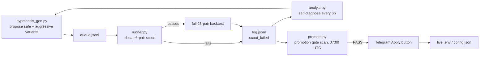

# The Brain

`scripts/brain/` is the autonomous hypothesis engine: it generates strategy variants, backtests
each one, self-diagnoses what's working, and promotes genuine winners to the live configuration —
without a human proposing each change. This page explains the loop; the exact functions live in
the [`scripts/brain` reference](reference/scripts/brain.md).

## The loop

Every experiment runs as a real, isolated FreqTrade Docker backtest — the brain never trusts a
config it hasn't actually simulated. A shared model-cache layer (`fam_<hash>_<window>`
identifiers) means a param-only variant that doesn't change what the model learns reuses an
already-trained model instead of retraining from scratch.

## The scout gate — cheap failure, fast

Before spending a full 25-pair backtest on a hypothesis, `runner.py` runs it on a fixed 6-pair
subset first (calibrated to the current live regime — different pairs for BULL vs BEAR vs
NEUTRAL). A hypothesis needs at least 40 trades and a profit factor above 1.0 on that cheap run
before it earns a full run. This alone eliminates most noise before it costs real compute.

## Promotion — deliberately hard to pass

`promote.py`'s gate requires, all at once: at least 150 total trades across evaluated windows, a
profit factor of at least 1.1 on each regime side, at least 2 independent bull windows and 1 bear
window passing, and — critically — **no catastrophic result on the most recent bear window**, even
if the candidate looks good on paper elsewhere. This bar exists because of a real, expensive
lesson: an earlier, looser gate once promoted a 45-trade sample with a profit factor near 1.05 —
statistically indistinguishable from noise — and that promotion manufactured a live losing streak
(see `CLAUDE.md`'s "Turnaround" session for the full diagnosis).

As of this writing the brain has never actually cleared this bar for the current z-scored target —
the [Directional module page](modules/directional.md) covers why, in detail, with current numbers.

## The rolling recent-window check (2026-09-10)

Every fixed calendar-quarter test window the brain uses eventually goes stale — three windows in
this project's history were literally renamed after the market moved and a window originally
labeled "bull" turned out to have been a bear quarter all along. `hypothesis_gen.py`'s
`RECENT_WINDOW_NAME` (`recent_90d`) sidesteps that permanently: it's recomputed to "today minus 90
days" on every brain run, so it never needs manual renaming. A companion script,
`queue_recent_validation.py` (daily cron, 05:00 UTC), tests the *exact* live `.env` configuration —
not just the brain's own drifted default seed — against this rolling window, so the brain
continuously checks itself against the config that's actually trading, on the market that's
actually happening right now.

## The edge gate

`scripts/edge_monitor.py` (cron, every 30 minutes) is not part of the brain's search loop — it's a
separate, blunter instrument that answers one question directly: *does the live model currently
have any measured edge at all?* It reads two independent signals — the live model's own rolling
30-day prediction quality (Spearman rank correlation between predictions and realized outcomes)
and the walk-forward pass/fail history — and pauses all new entries in the live strategy the
moment either one says no. It doesn't wait for the brain to find something better first.

This exists because of a specific, measured gap: as of 2026-09-07, walk-forward had returned
`FAIL` for 197 consecutive runs spanning three months, and the live model's prediction quality had
been at essentially zero since a regime flip 13 days earlier — and nothing had ever acted on
either fact. The system was correctly *measuring* its own failure the entire time; it just wasn't
*responding* to the measurement. `edge_monitor.py` closes exactly that gap. See
[Strategy](strategy.md#circuit-breakers) for how the strategy consumes its output, and the
[Directional module page](modules/directional.md) for the current live numbers.
