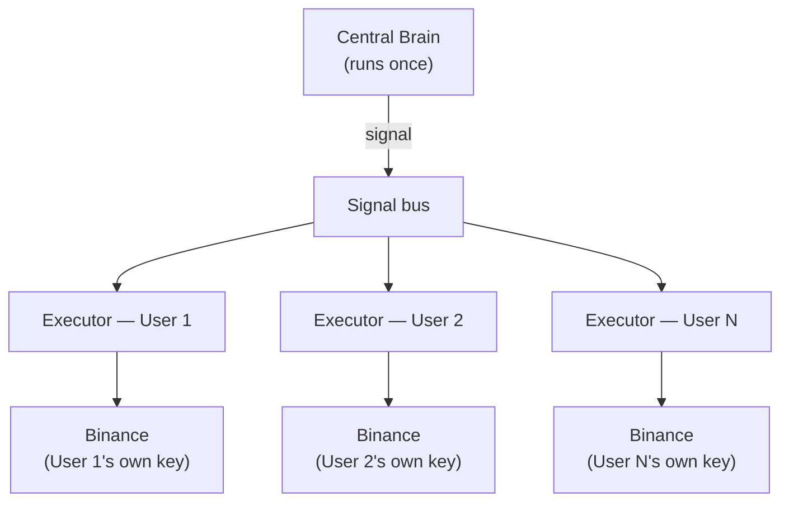

# Platform Vision & Scaling Architecture

Cortexa's long-term shape is a multi-tenant SaaS platform: one central brain, many users, each
plugging in their own exchange account. This page covers the architecture decision behind that,
what it costs to run today, and what stays true as it scales.

## The architecture decision: Signal-as-a-Service

Full detail in `finbuddy_memory/docs/ADR-001-multi-tenant-architecture.md`. Three options were
weighed:

- **Option A — one FreqTrade container per user.** Simple, battle-tested, but RAM and market-data
  cost scale linearly with user count — genuinely caps out around 15-30 users on the current
  infrastructure envelope.
- **Option B — a shared, forked FreqTrade pool.** Better resource sharing, but user isolation
  becomes a shared-mutable-state problem — one user's bug or bad data can cascade to others.
- **Option C — Signal-as-a-Service + thin per-user executor** (chosen). One central brain runs
  once, publishes trading signals (pair, side, confidence, stop, regime, strategy id). Each user
  runs a lightweight, non-custodial executor (a few hundred lines) that sizes the position against
  their own capital and places the trade with their own API key, scoped for trading only — never
  withdrawal.

The reason this wins: every expensive part — the market data feed, the regime engine, the
hypothesis-testing brain itself — costs the same whether there's 1 user or 1,000. Quality
*improves* with scale too, since a centralized brain can run heavier backtests and more data
sources than N separate, weaker per-user brains could each afford. Each user's own Binance rate
limit is theirs alone — one user's executor being slow or rate-limited never touches another's.

## Two deliberate phases

**Phase 1 (now, single user):** the full Option C *shape* is already built — the signal contract
(`finbuddy_memory/docs/signal-contract.md`) is a defined schema, user identity is already a
parameter throughout, the brain and the trading logic are already separated — but the *deployment*
is exactly one user. No signup flow, no billing, no user-facing dashboard yet. This is deliberate:
retrofitting multi-tenant shape onto code that wasn't built for it later is the expensive move;
building it in from the start costs an estimated 10-20% more effort up front and avoids a multi-week
rewrite later.

**Phase 2 (after a real live track record):** add what turns multi-tenant-*shaped* code into an
actual multi-tenant product — signup, encrypted API-key storage, a user dashboard, billing. The
brain and executor themselves don't change; adding user 2 becomes a config entry, not a rewrite.

This is explicitly gated on evidence, not a calendar date — see [Roadmap](roadmap.md) for why
Phase 2 hasn't started yet.

## What this costs to run today

The entire system — brain, live trading, every paper module, the dashboard, and now this docs
site — runs on a single Oracle Cloud Free Tier server (4 vCPU, 24GB RAM), with a hard infrastructure
cost ceiling of $3-5/month for everything beyond that free tier (LLM API calls, mainly). No
Kubernetes, no microservices, no per-user containers — every design decision here respects that a
solo operator manages the whole thing from a phone over SSH, and operational complexity has to stay
low enough for that to keep being true as it grows.

## AI model assignment — by task, not by default

| Task | Model | Why |
|---|---|---|
| Signal confirmation | Grok-3-Mini (xAI) | Cheapest tier that was accurate enough for this specific gate |
| Coding & operations | Claude | Used sparingly — the expensive-per-token tier reserved for work that needs it |
| Large-context research | Gemini 2.5 Flash | Free tier, used for the nightly research loop |
| Cheap hypothesis generation | DeepSeek | ~$0.01/M tokens |

This has already changed twice (OpenRouter → Groq → the current matrix) and will change again
whenever a better or cheaper option exists — see `CLAUDE.md`'s "This Is a Fluid System" section.
The project's own stated principle: optimize for what moves the brain forward, not for preserving
a past tooling decision.
